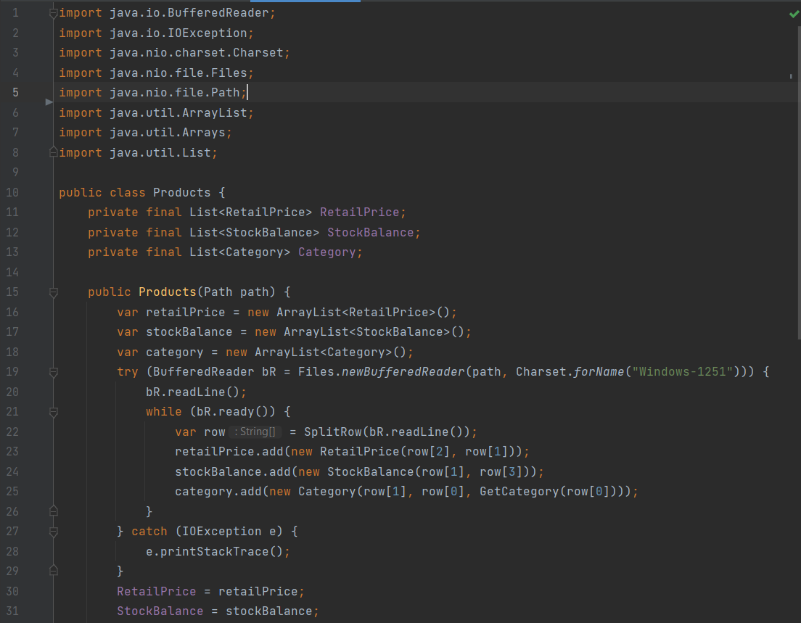
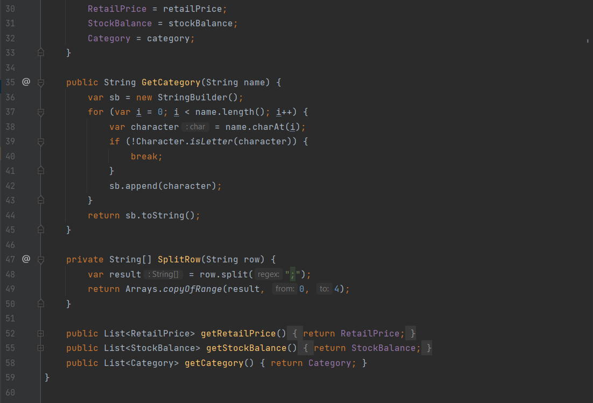
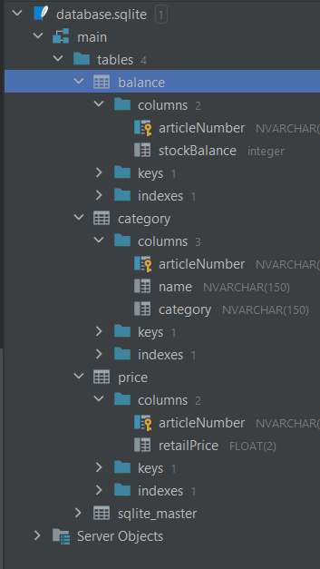
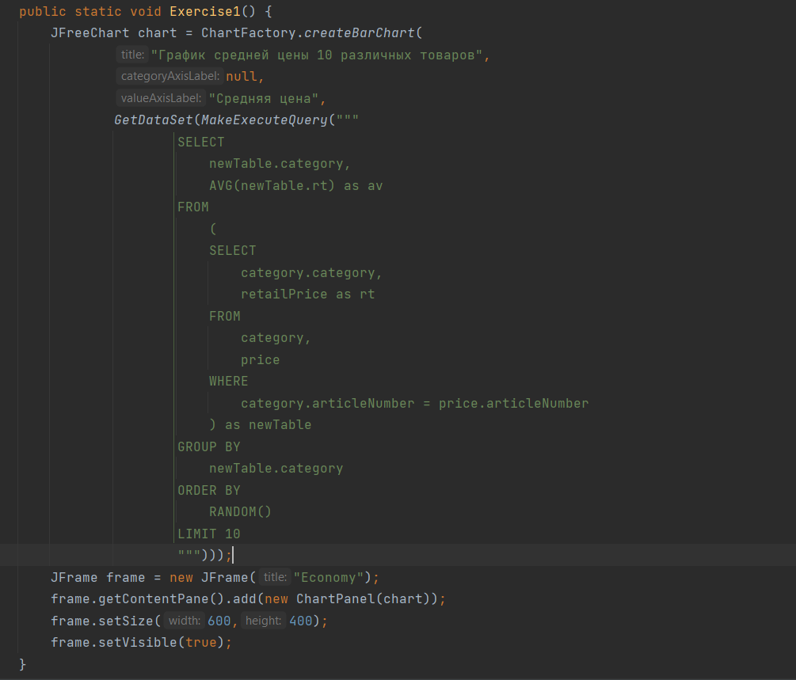
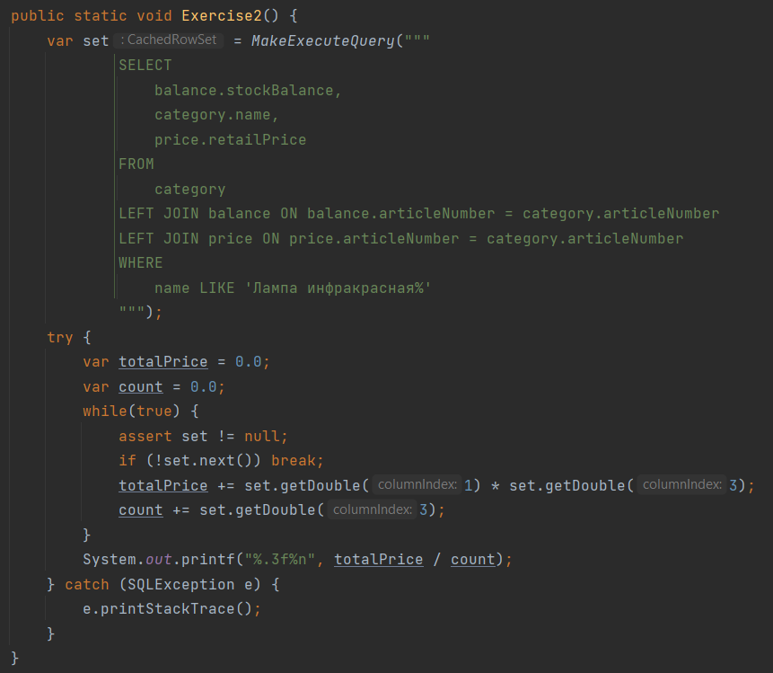
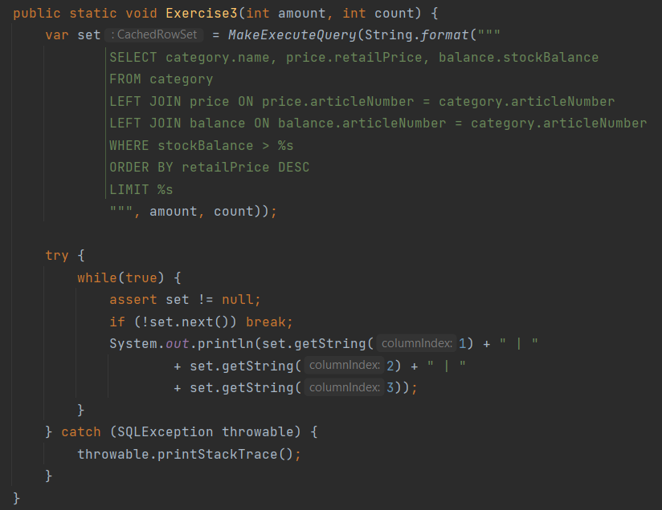
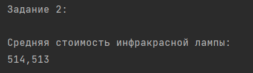
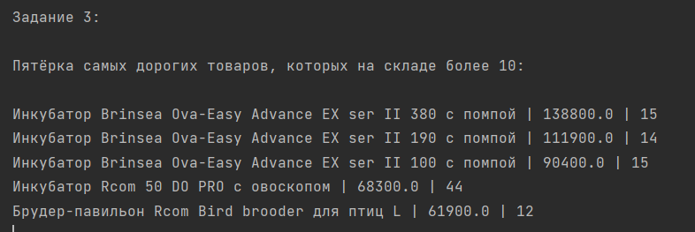
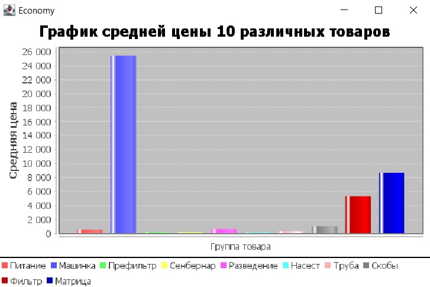
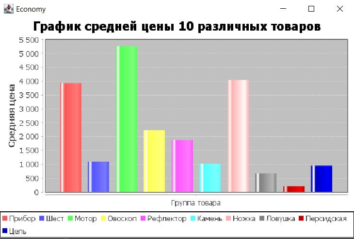

# Java-project
Итоговый проект по курсу "Java. Основы программирования на РТФ."

Выполнил: Фокин Богдан Сергеевич.

1) Вариант 2.

2) Создал набор классов с необходимым составом полей и методов для хранения и обработки всех данных:

Products - хранение информации распаршеного CSV файла, до её сохранения в БД;

RetailPrice - элемент таблицы price (столбцы: артикул, розничная цена);

StockBalance - элемент таблицы balance (столбцы: артикул, остаток на складе);

Category - элемент таблицы category (столбцы: артикул, наименование товара, категория)

ProductCatalog - основной класс с задачами

Для выполнения заданий мне пришлось добавить новый столбец "категория товара", который определяется по первому слову из наименования товара. Да, это не совсем правильно, так как чтобы правильно определять категорию товара нужен искусственный интелект, но на данный момент у меня нет таких познаний. Поэтому пришлось использовать данное решение.

3) Распарсил CSV фаил и сохранил все данные:

4) Создал файл БД SQL Lite и подключил ее к проекту.

5) В БД создал набор таблиц (по 3-ей нормальной форме) согласно набору объектов.

6) Все данные из набора объектов сохранил в БД.

7) Сделал набор SQL-запросов к БД согласно своему варианту задания.

   Задание 1: 

   Задание 2: 

   Задание 3: 

8) Полученные данные вывел в текстовом виде в консоль:

   
   

9) Числовые данные по заданию визуализировал в виде гистограммы:
   
   

Для первого запуска программы нужно указать, что вы хотите распарсить CSV-файл. Программа собирается на JDK-15.